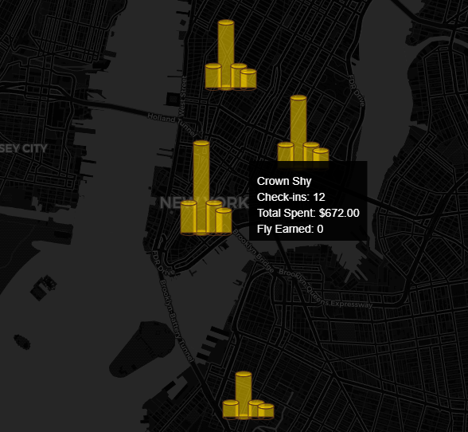

# Wrapped - Restaurant Spending Visualization

A Next.js application that visualizes restaurant spending data on an interactive map using 3D bar charts.



## Technologies Used

- [Next.js](https://nextjs.org) - React framework for production
- [Leaflet](https://leafletjs.com/) - Open-source JavaScript library for mobile-friendly interactive maps
- [React Leaflet](https://react-leaflet.js.org/) - React components for Leaflet maps

## Features

- Interactive 3D bar chart visualization of restaurant spending
- Dynamic data aggregation based on zoom level
- Smooth animations and transitions
- Responsive design
- Interactive tooltips with detailed spending information

## Getting Started

First, run the development server:

```bash
npm run dev
# or
yarn dev
# or
pnpm dev
# or
bun dev
```

Open [http://localhost:3000](http://localhost:3000) with your browser to see the result.

## Project Structure

```
src/
├── app/              # Next.js app directory
├── components/       # React components
├── constants/        # Application constants
├── data/             # Static data and configurations
├── styles/           # Global styles and CSS
├── types/            # TypeScript type definitions
└── utils/            # Utility functions
```

## Acknowledgments

This project uses several open-source libraries:

- [Leaflet](https://leafletjs.com/) - An open-source JavaScript library for mobile-friendly interactive maps
- [React Leaflet](https://react-leaflet.js.org/) - React components for Leaflet maps
- [Next.js](https://nextjs.org) - The React framework for production
- [Geist Font](https://vercel.com/font) - A modern font family by Vercel

## Learn More

To learn more about the technologies used in this project:

- [Next.js Documentation](https://nextjs.org/docs)
- [Leaflet Documentation](https://leafletjs.com/reference.html)
- [React Leaflet Documentation](https://react-leaflet.js.org/docs/start-introduction)

## Known Issues

- Map is resource intensive
- Scaling with zoom levels are strange
- If zoomed too far out, it looks bad

## Possible improvements

- Test the data generation
- Optimize
- Polish the visuals and theme

## License

This project is licensed under the MIT License - see the LICENSE file for details.

